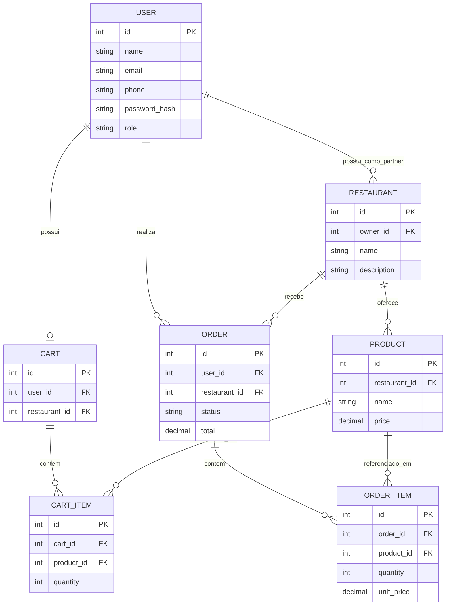
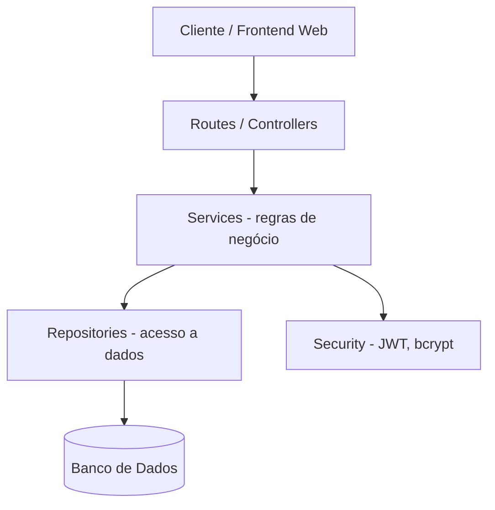
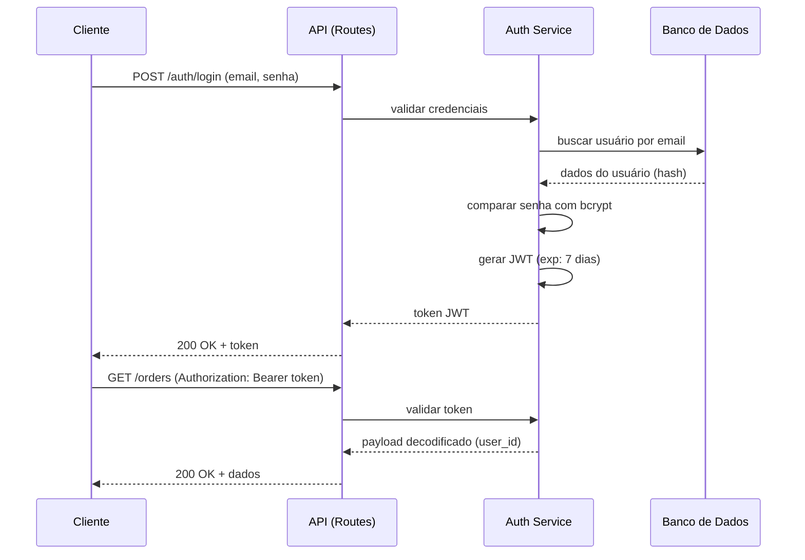

# Design/Arquitetura — Rangos

**Versão:** 1.0
**Data:** 12/07/2026
**Autor:** Dienay Lima
**Fase do SDLC:** Design/Arquitetura
**Base:** [Requisitos](02-requirements.md)

---

## 1. Introdução

Este documento traduz os requisitos funcionais e não-funcionais do Rangos em decisões de arquitetura e modelagem de dados, servindo de base para a fase de Desenvolvimento. Toda decisão registrada aqui é rastreável a um requisito ou decisão de PO da fase anterior.

---

## 2. Modelo de Dados

### 2.1 Entidades e Atributos

#### User

- id (PK)
- name
- email (único)
- phone (único)
- password_hash
- role (enum: customer, partner)
- created_at

#### Restaurant

- id (PK)
- owner_id (FK → User, deve ser um usuário com role=partner)
- name
- description
- created_at

#### Product

- id (PK)
- restaurant_id (FK → Restaurant)
- name
- description
- price
- created_at

#### Cart

- id (PK)
- user_id (FK → User, único — um carrinho ativo por usuário)
- restaurant_id (FK → Restaurant, nullable até o primeiro item ser adicionado)
- created_at
- updated_at

#### CartItem

- id (PK)
- cart_id (FK → Cart)
- product_id (FK → Product)
- quantity

#### Order

- id (PK)
- user_id (FK → User)
- restaurant_id (FK → Restaurant)
- status (enum: received, preparing, out_for_delivery, delivered)
- total
- created_at
- updated_at

#### OrderItem

- id (PK)
- order_id (FK → Order)
- product_id (FK → Product)
- quantity
- unit*price*(snapshot do preço no momento do pedido — importante para não quebrar histórico se o preço do produto mudar depois)\_

### 2.2 Diagrama Entidade-Relacionamento



### 2.3 Regras de integridade refletidas no modelo

- `Cart.restaurant_id` implementa a decisão de PO do RF-08 (carrinho restrito a um restaurante): ao adicionar o primeiro item, o carrinho "trava" nesse restaurante; adicionar produto de outro restaurante exige esvaziar o carrinho antes.
- `Order.status` é um enum fechado, e a transição entre valores é validada na camada de serviço (não apenas no banco), implementando a regra sequencial obrigatória do RF-15.
- `OrderItem.unit_price` é um snapshot — garante que o valor do pedido não mude retroativamente se o preço do produto for alterado depois.
- `Restaurant.owner_id` implementa a decisão de PO sobre tipos de usuário: apenas usuários com `role=partner` podem ser donos de restaurante, e a camada de serviço deve validar que o Partner autenticado só gerencia (produtos, status de pedido) restaurantes dos quais é dono.

---

## 3. Arquitetura da Aplicação

### 3.1 Estilo arquitetural

Arquitetura em camadas (layered architecture), adequada ao porte do MVP e ao objetivo de manter o código testável e organizado sem a complexidade de microsserviços (já descartados no planejamento).



**Responsabilidade de cada camada:**

| Camada             | Responsabilidade                                                                                  |
| ------------------ | ------------------------------------------------------------------------------------------------- |
| Routes/Controllers | Receber requisições HTTP, validar entrada (schemas Pydantic), retornar respostas                  |
| Services           | Regras de negócio (ex: validar transição de status, validar restrição de restaurante no carrinho) |
| Repositories       | Acesso e persistência de dados (queries)                                                          |
| Security           | Hashing de senha (bcrypt), geração/validação de JWT                                               |
| Models             | Definição das entidades (ORM)                                                                     |
| Schemas            | Contratos de entrada/saída da API (Pydantic)                                                      |

### 3.2 Estrutura de Pastas (monorepo)

Estrutura de repositório único (monorepo), cobrindo código, documentação e testes de forma organizada — adequada ao objetivo de portfólio, que exige visibilidade tanto do código quanto do processo de QA.

```dir
rangos-platform/
├── apps/
│   ├── backend/
│   │   ├── app/
│   │   │   ├── main.py
│   │   │   ├── core/
│   │   │   │   ├── config.py
│   │   │   │   └── security.py
│   │   │   ├── models/
│   │   │   │   ├── user.py
│   │   │   │   ├── restaurant.py
│   │   │   │   ├── product.py
│   │   │   │   ├── cart.py
│   │   │   │   └── order.py
│   │   │   ├── schemas/
│   │   │   │   ├── user.py
│   │   │   │   ├── restaurant.py
│   │   │   │   ├── product.py
│   │   │   │   ├── cart.py
│   │   │   │   └── order.py
│   │   │   ├── routes/
│   │   │   │   ├── auth.py
│   │   │   │   ├── restaurants.py
│   │   │   │   ├── products.py
│   │   │   │   ├── cart.py
│   │   │   │   └── orders.py
│   │   │   ├── services/
│   │   │   │   ├── auth_service.py
│   │   │   │   ├── cart_service.py
│   │   │   │   └── order_service.py
│   │   │   └── repositories/
│   │   │       ├── user_repository.py
│   │   │       ├── restaurant_repository.py
│   │   │       ├── product_repository.py
│   │   │       ├── cart_repository.py
│   │   │       └── order_repository.py
│   │   ├── Dockerfile
│   │   └── requirements.txt
│   ├── frontend/
│   │   └── [estrutura a definir na fase de desenvolvimento do frontend]
│   └── mobile/
│       └── [fora do escopo do MVP — placeholder para versões futuras]
│
├── docs/
│   ├── sdlc/
│   │   ├── 01-planejamento-rangos.md
│   │   ├── 02-requisitos-rangos.md
│   │   ├── 03-architecture.md
│   │   ├── 04-testing.md
│   │   ├── 05-development.md
│   │   ├── 06-deployment.md
│   │   └── 07-roadmap.md
│   ├── api/
│   │   ├── API_REFERENCE.md
│   │   ├── AUTH_GUIDE.md
│   │   ├── ERRORS.md
│   │   └── MODELS.md
│   └── qa/
│       ├── test-cases/
│       ├── bugs/
│       ├── bug-backlog.md
│       └── matriz-de-rastreabilidade.md
│
├── tests/
│   ├── unit/
│   ├── integration/
│   ├── contract/
│   ├── e2e/
│   ├── performance/
│   └── security/
│
├── docker-compose.yml
└── .github/
    └── workflows/
        └── ci.yml
```

**Observações:**

- `apps/mobile/` é um placeholder — fora do escopo do MVP conforme decidido na fase de Planejamento. Mantido na estrutura para sinalizar visão de longo prazo do projeto, sem conteúdo ativo nesta fase.
- `tests/unit/` e `tests/integration/` no root cobrem testes de todos os apps (não só backend); a suíte do backend em si pode manter testes auxiliares dentro de `apps/backend/` se necessário para configuração de fixtures, mas os testes de negócio residem em `tests/`.
- `tests/contract/`, `tests/e2e/`, `tests/performance/` e `tests/security/` ficam vazios até as fases correspondentes da estratégia de testes (a definir em `docs/estrategia-de-testes.md`).
- `.github/workflows/` fica na raiz do monorepo (padrão obrigatório do GitHub Actions), e não dentro de `apps/backend/`.

---

## 4. Especificação dos Endpoints da API

### 4.1 Autenticação

| Método | Endpoint         | Auth | RF    | Descrição             |
| ------ | ---------------- | ---- | ----- | --------------------- |
| POST   | `/auth/register` | Não  | RF-01 | Cadastro de usuário   |
| POST   | `/auth/login`    | Não  | RF-02 | Login, retorna JWT    |
| PUT    | `/auth/me`       | Sim  | RF-03 | Atualização de perfil |

### 4.2 Restaurantes

| Método | Endpoint            | Auth          | RF    | Descrição                                                  |
| ------ | ------------------- | ------------- | ----- | ---------------------------------------------------------- |
| GET    | `/restaurants`      | Não           | RF-04 | Lista restaurantes                                         |
| GET    | `/restaurants/{id}` | Não           | RF-05 | Detalhes do restaurante                                    |
| POST   | `/restaurants`      | Sim (Partner) | RF-16 | Cadastro de restaurante (vinculado ao Partner autenticado) |

### 4.3 Produtos

| Método | Endpoint                     | Auth                               | RF    | Descrição           |
| ------ | ---------------------------- | ---------------------------------- | ----- | ------------------- |
| GET    | `/restaurants/{id}/products` | Não                                | RF-06 | Lista cardápio      |
| GET    | `/products/{id}`             | Não                                | RF-07 | Detalhes do produto |
| POST   | `/products`                  | Sim (Partner, dono do restaurante) | RF-17 | Cadastro de produto |

### 4.4 Carrinho

| Método | Endpoint           | Auth | RF    | Descrição           |
| ------ | ------------------ | ---- | ----- | ------------------- |
| GET    | `/cart`            | Sim  | RF-11 | Visualizar carrinho |
| POST   | `/cart/items`      | Sim  | RF-08 | Adicionar produto   |
| DELETE | `/cart/items/{id}` | Sim  | RF-09 | Remover produto     |
| PATCH  | `/cart/items/{id}` | Sim  | RF-10 | Alterar quantidade  |

### 4.5 Pedido

| Método | Endpoint              | Auth                               | RF    | Descrição                         |
| ------ | --------------------- | ---------------------------------- | ----- | --------------------------------- |
| POST   | `/orders`             | Sim                                | RF-12 | Criar pedido a partir do carrinho |
| GET    | `/orders`             | Sim                                | RF-13 | Listar pedidos do usuário         |
| GET    | `/orders/{id}`        | Sim                                | RF-14 | Detalhes do pedido                |
| PATCH  | `/orders/{id}/status` | Sim (Partner, dono do restaurante) | RF-15 | Alterar status (sequencial)       |

---

## 5. Fluxo de Autenticação (JWT)



> Expiração de 7 dias definida para o período de desenvolvimento (decisão de PO registrada em `02-requirements.md`). Revisar antes de deploy próximo de produção.

---

## 6. Padrão de Respostas e Tratamento de Erros

| Código | Situação                                                             |
| ------ | -------------------------------------------------------------------- |
| 200    | Sucesso                                                              |
| 201    | Recurso criado                                                       |
| 400    | Erro de validação (ex: senha curta, quantidade inválida)             |
| 401    | Não autenticado (token ausente/inválido)                             |
| 403    | Autenticado, mas sem permissão (ex: acessar pedido de outro usuário) |
| 404    | Recurso não encontrado                                               |
| 409    | Conflito (ex: e-mail duplicado, transição de status inválida)        |

Formato de erro padronizado (exemplo):

```json
{
  "detail": "Mensagem descritiva do erro"
}
```

---

## 7. Decisões de Arquitetura (registro)

| Decisão                                                             | Justificativa                                                                                                            |
| ------------------------------------------------------------------- | ------------------------------------------------------------------------------------------------------------------------ |
| Arquitetura em camadas, não microsserviços                          | Escopo do MVP não justifica a complexidade; microsserviços já descartados no planejamento                                |
| Preço do produto salvo como snapshot em OrderItem                   | Evita que histórico de pedidos mude se o preço do produto for alterado depois                                            |
| Validação de transição de status na camada de serviço               | Regra de negócio (RF-15) não deve depender só de constraint de banco, para permitir mensagens de erro claras             |
| Restrição de restaurante único no carrinho via `Cart.restaurant_id` | Implementa diretamente a decisão de PO do RF-08                                                                          |
| JWT sem refresh token nesta fase                                    | Simplicidade para o MVP; expiração de 7 dias reduz necessidade de re-login durante testes manuais                        |
| Papéis fixos (Customer, Partner) sem acúmulo                        | Simplifica o modelo de autorização no MVP; um usuário Partner não faz pedidos como Customer nesta versão                 |
| Autorização por posse (`owner_id`) em vez de role genérica "admin"  | Reflete modelo multi-vendor real; permite testes de autorização granulares (Partner só age sobre seus próprios recursos) |
